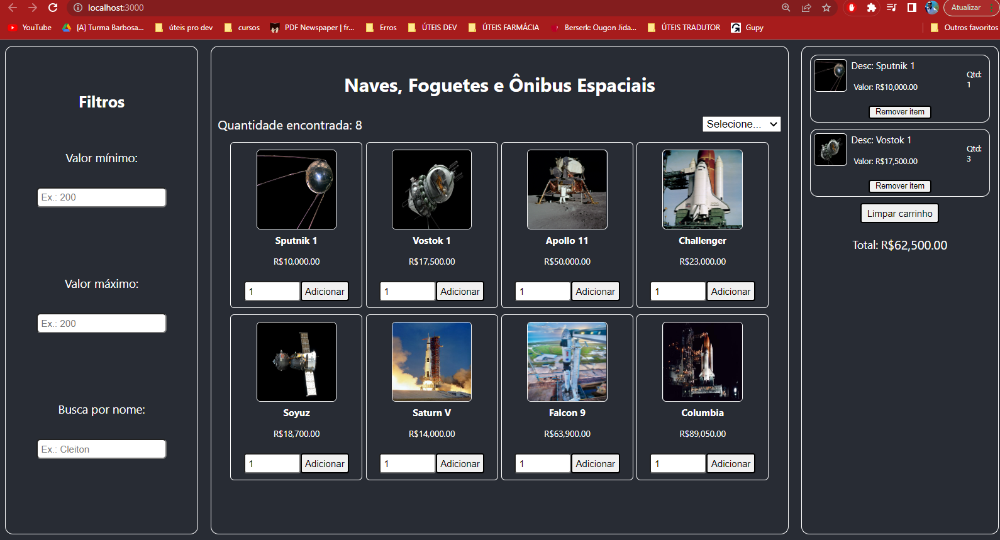

Projeto introdução ao front-end com ReactJS

Esse é o projeto de introdução aos fundamentos do React. Aqui, vamos praticar a estrutura do que consideramos a estrutura do React. O objetivo é que funcione como o front-end de um E-Commerce. Conceitos trabalhados abaixo:

- JSX
- Componentes
- Props
- Estado
- Fluxo de dados no React
- Renderização de listas
- Renderização condicional
- localStorage

Link do surge: https://hungry-earthquake.surge.sh/ (05/05/2023)

